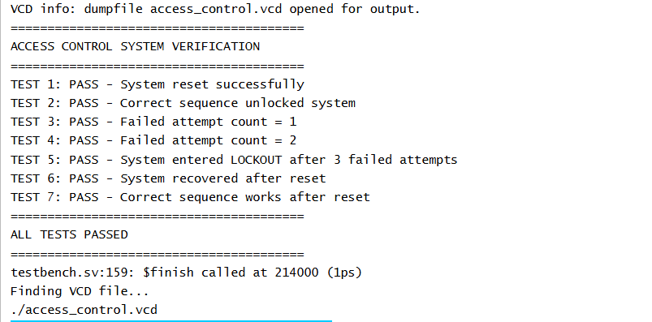
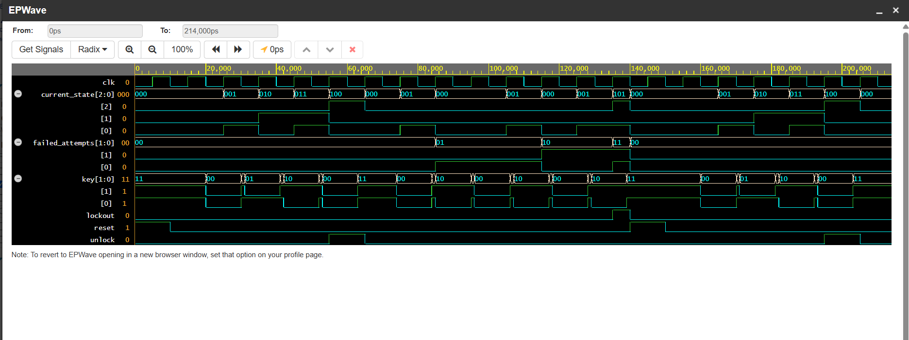

# FSM-Based Digital Access Control System

An RTL-based digital access control system implemented using **Verilog HDL**. The design uses a **Finite State Machine (FSM)** to validate a predefined input sequence, track failed access attempts, and automatically lock the system after three consecutive invalid attempts.

## Overview

The system validates the following predefined access sequence:

```text
A → B → C → A
00 → 01 → 10 → 00
```

The key encoding used in the design is:

| Key | Binary Input |
|-----|-------------|
| A | `00` |
| B | `01` |
| C | `10` |

When the correct sequence is entered, the system activates the `unlock` output.

If an incorrect input is entered while validating the sequence, the failed-attempt counter is incremented. After three failed attempts, the system enters the `LOCKOUT` state and remains locked until a reset is applied.

---

## Features

- RTL implementation using Verilog HDL
- Finite State Machine (FSM)-based sequence detection
- Predefined access sequence validation
- Failed-attempt tracking
- Automatic lockout after three failed attempts
- Reset-based recovery from lockout
- Verilog testbench for functional verification
- Waveform-based simulation

---

## FSM States

The FSM consists of six states:

| State | Description |
|-------|-------------|
| `S0` | Waiting for the first input `A` |
| `S1` | `A` received, waiting for `B` |
| `S2` | `A → B` received, waiting for `C` |
| `S3` | `A → B → C` received, waiting for the final `A` |
| `UNLOCK` | Correct sequence detected and access granted |
| `LOCKOUT` | System locked after three failed attempts |

### State Encoding

| State | Binary Value |
|-------|-------------|
| `S0` | `000` |
| `S1` | `001` |
| `S2` | `010` |
| `S3` | `011` |
| `UNLOCK` | `100` |
| `LOCKOUT` | `101` |

---

## Functional Operation

### 1. Correct Access Sequence

The correct input sequence is:

```text
00 → 01 → 10 → 00
```

The corresponding state transitions are:

```text
S0 → S1 → S2 → S3 → UNLOCK
```

When the FSM enters the `UNLOCK` state, the `unlock` output is asserted.

---

### 2. Invalid Input

If an incorrect key is entered while the system is validating the access sequence:

- The FSM returns to the initial state `S0`
- The `failed_attempts` counter is incremented

---

### 3. Lockout Mechanism

The system tracks failed attempts as:

```text
0 → 1 → 2 → 3
```

After the third failed attempt:

```text
FSM → LOCKOUT
lockout → HIGH
```

The system remains in the `LOCKOUT` state until a reset is applied.

---

### 4. Reset Operation

When `reset` is asserted:

```text
current_state   → S0
failed_attempts → 0
unlock          → 0
lockout         → 0
```

The system can then accept a new access sequence.

---

## Project Structure

```text
FSM-Based-Digital-Access-Control-System/
│
├── src/
│   └── access_control.v
│
├── tb/
│   └── access_control_tb.v
│
├── sim/
│   └── run_simulation.sh
│
└── README.md
```

---

## Input and Output Signals

| Signal | Type | Description |
|--------|------|-------------|
| `clk` | Input | System clock |
| `reset` | Input | Resets the FSM and failed-attempt counter |
| `key[1:0]` | Input | Two-bit access key input |
| `unlock` | Output | Indicates successful access |
| `lockout` | Output | Indicates that the system is locked |
| `failed_attempts[1:0]` | Output | Tracks the number of failed attempts |
| `current_state[2:0]` | Output | Indicates the current FSM state |

---

## Verification

A self-checking Verilog testbench was developed to verify the following functionality:

- System reset operation
- Correct access sequence detection
- Invalid input handling
- Failed-attempt tracking
- Automatic lockout after three failed attempts
- Reset recovery from the lockout state
- Successful access after reset

The testbench performs seven functional checks and reports PASS/FAIL status automatically.

---

## Simulation

The design was simulated using:

- **Icarus Verilog**
- **EPWave / GTKWave**
- **EDA Playground**

### Verification Results

The self-checking testbench successfully passed all seven functional tests.



### Simulation Waveform

The waveform verifies FSM state transitions, key inputs, failed-attempt counting, reset operation, successful access detection, and automatic lockout.



---

## Running the Simulation

From the `sim` directory:

```bash
chmod +x run_simulation.sh
./run_simulation.sh
```

The simulation script:

1. Compiles the Verilog design and testbench using Icarus Verilog
2. Runs the simulation
3. Generates the `access_control.vcd` waveform file
4. Opens the waveform using GTKWave

---

## Tools and Technologies

- Verilog HDL
- Finite State Machine (FSM)
- Icarus Verilog
- GTKWave
- EPWave
- EDA Playground

---

## Author

**Abhinav Anand**

Electronics and Communication Engineering
